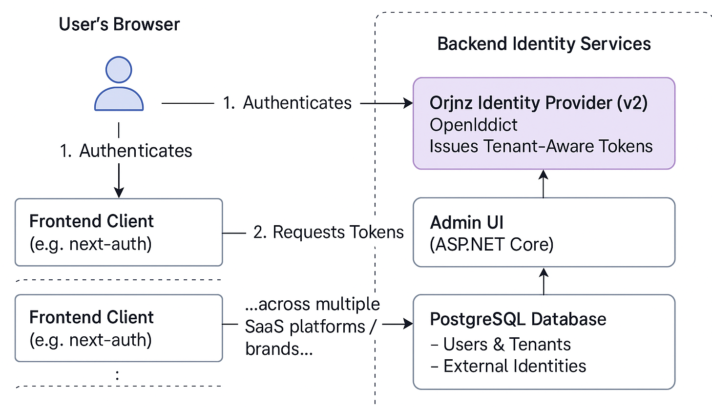

# 🪪 Orjnz Identity Provider (v2)

A reusable, multi-tenant OpenID Connect Identity Provider built with **.NET 9**, **OpenIddict**, and **PostgreSQL** — designed to be used across multiple SaaS platforms with minimal configuration.

---

## ✨ Why This Exists

During a logistics platform project, I needed a simple authentication system — but ended up going deeper than expected. What started as overengineering turned into a reusable identity layer I could use across all my future platforms and client projects.

This identity provider is my attempt to **build once and reuse everywhere** — with support for:
- Adding OAuth providers via the Admin UI
- Issuing tenant-aware tokens
- Supporting external clients (e.g., Next.js, mobile apps)

---

## 🔧 Features

- ✅ OpenID Connect Identity Provider using **OpenIddict**
- ✅ Multi-tenant aware (via `provider_id` claim)
- ✅ Admin UI to manage:
  - Tenants (aka Providers)
  - Applications (OIDC Clients)
  - Users
- ✅ Works with `next-auth` or any OIDC-compliant client
- ✅ Case study and documentation included

---

## 📸 Architecture Diagram



A single identity server serves multiple frontend clients across brands and domains, all managed through a unified admin UI.

---

## 🚀 Getting Started

### 📦 Requirements

- [.NET 9 SDK](https://dotnet.microsoft.com)
- PostgreSQL


### 🛠️ Run Locally

```bash
# Clone the repo
git clone https://github.com/fady17/identityProvider-.git
cd identityProvider-

# Setup your local PostgreSQL and update connection strings
run the intial migration 
# Apply EF Core migrations
dotnet ef database update

# Run the Identity Provider
dotnet run 

🔑 Admin Credentials

Default credentials are seeded (configurable):
	•	Email: admin@orjnz.com
	•	Password: P@ssw0rd!

✏️ You can change this in the DataSeeder.cs file or through the UI after login.

⸻

📚 Case Study & Documentation

If you’re curious about the why, I wrote a full reflection on the lessons I learned transitioning from Duende to OpenIddict and designing for reuse:

👉 Read the Case Study

⸻

🔐 Security Status

⚠️ This project is currently in alpha and not hardened for production use. Please conduct your own security review before deploying in sensitive environments.

⸻

💬 Feedback & Contributions

This is a personal project born from necessity and curiosity. If you have suggestions, ideas, or use cases — feel free to:
	•	Open an issue
	•	Fork and experiment
	

⸻

